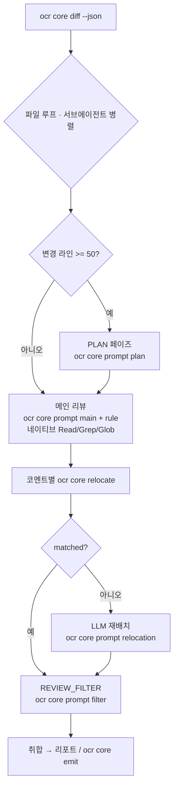

# ocr-core: API key 없이 Claude Code 안에서 도는 코드리뷰

## Summary

ocr에 LLM 의존이 없는 `ocr core` 명령 그룹을 추가하고(결정론 영역: diff 파싱·라인 재배치·룰·프롬프트·출력 계약), Claude Code 스킬이 이를 `sh`로 호출하며 추론(두뇌) 역할을 맡아 별도 API key 없이 구독만으로 ocr 풀 패리티 리뷰를 돌린다. 기존 `ocr review`(LLM 풀 리뷰)와 `internal/llm`은 그대로 유지하는 제적(additive) 방식이다.

## Problem Frame

ocr는 항상 외부 LLM 엔드포인트로 직접 HTTP를 호출하는 독립 바이너리이고, `internal/llm/resolver.go`의 4단계 자격증명 해석은 모두 `URL+Token+Model`을 요구한다. 즉 토큰 없이는 한 줄도 못 돈다. Claude Pro/Max 구독으로 로그인만 한 환경에서는 자격증명이 `~/.claude/.credentials.json`에 저장되고 환경변수로 노출되지 않아 ocr가 이를 재사용하지 못한다.

한편 ocr의 가치(README 기준 동일 모델 대비 토큰 약 1/9, 높은 Precision, line-level 정밀도)는 프롬프트가 아니라 LLM 호출 *주변의* 결정론적 오케스트레이션(diff 파싱, hunk 매핑, 코멘트 라인 재배치, 멀티 페이즈, 필터)에서 나온다. 그 결정론 부분은 `internal/llm` 없이도 동작한다 — `ocr review --preview`가 이미 LLM을 한 번도 부르지 않고 diff 파이프라인을 JSON으로 출력하는 것이 그 증거다. 따라서 "결정론 기계 ↔ LLM 두뇌"의 이음매에서 갈라, 두뇌만 Claude Code 구독으로 갈아끼우면 API key 비용 없이 ocr 품질 리뷰가 가능하다.

## Key Decisions

- **제적(additive) 코어** — `ocr review`와 `internal/llm`을 삭제하지 않고 그대로 둔 채, LLM에 의존하지 않는 `ocr core ...` 명령 그룹만 추가한다. 하나의 바이너리에 두 용도를 두어 업스트림 PR 가능성을 유지한다.
- **Claude Code = 두뇌, 코어 = 결정론 기계** — LLM 추론·도구 사용은 Claude Code(구독)가 맡고, 코어는 LLM을 호출하지 않는 결정론 작업만 sh 경계 너머로 제공한다.
- **Tier 3 풀 패리티** — 스킬이 PLAN(50줄↑ 리스크 분석)·메인 리뷰·라인 재배치·REVIEW_FILTER(오탐 반증) 페이즈를 모두 재현해 ocr의 Precision을 확보한다.
- **도구는 네이티브로 매핑** — ocr의 `file_read`/`code_search`/`file_find`는 Claude Code의 `Read`/`Grep`/`Glob`로 대응하므로 코어에 재구현하지 않는다.
- **동시성은 서브에이전트로** — ocr의 인프로세스 goroutine 8워커 대신 Claude Code parallel 서브에이전트로 파일별 병렬을 회복한다.
- **출력은 기존 계약 재사용** — `ocr core emit`은 `cmd/opencodereview/output.go`의 `jsonOutput` 구조를 그대로 써 기존 CI 소비자가 무변경으로 동작한다.

## Requirements

**코어 명령 그룹 (`ocr core`)**

- R1. `ocr core`의 모든 서브커맨드는 LLM/네트워크 호출 없이 동작한다. (`internal/llm` 패키지 임포트 수준의 비의존이 아니라 런타임 기준 — 코어 커맨드 실행 경로에서 LLM/네트워크 호출이 0임을 의미한다. Planning에서 이 의미를 못박는다.)
- R2. `ocr core diff`는 리뷰 대상 파일 목록, 파일별 unified diff, hunk 라인맵, 제외 사유를 JSON으로 출력한다. 기존 diff 로드와 `preview` 필터 로직을 재사용하되, `ocr review`의 `filterLargeDiffs`(diff가 `MAX_TOKENS`의 80% 초과 시 제외)와 동일한 토큰 사전필터를 적용하고 제외 사유로 보고해 `ocr review`와 입력 파일 집합을 일치시킨다.
- R3. `ocr core relocate`는 diff, 해당 파일의 `new_file_content`(또는 `ocr core diff` 산출값), 코멘트(내용·`existing_code`)를 입력받아 결정론적 매칭으로 정확한 `start_line`/`end_line`과 매칭 성공 여부를 반환한다. `new_file_content`는 `ResolveComment`의 파일-콘텐츠 폴백을 활성화한다. `internal/diff/resolver.go`의 `ResolveComment`를 래핑한다.
- R4. `ocr core rule <path>`는 해당 경로에 매칭되는 리뷰 룰 문서를 출력한다.
- R5. `ocr core prompt <phase>`는 임베디드 프롬프트를 출력해 스킬이 레포 소스트리 없이도 프롬프트를 얻게 한다. 스킬이 소비하는 phase는 main/plan/filter/relocation이며, `compression`(MEMORY_COMPRESSION)은 Scope Boundaries에 따라 제외한다.
- R6. `ocr core emit`은 코멘트 배열을 기존 `jsonOutput` 계약(파일 수·코멘트·요약·경고)으로 감싸 출력한다.

**기존 동작 보존**

- R7. `ocr review`를 비롯한 기존 명령은 변경 없이 동작한다. `core`는 추가일 뿐 기존 경로를 대체하지 않는다.

**Claude Code 스킬 (두뇌 오케스트레이션)**

- R8. 스킬은 `ocr core diff`로 대상을 얻고 파일별 리뷰 파이프라인을 수행한다.
- R9. 변경 라인(= insertions + deletions, ocr `changeLines`와 동일)이 50 이상인 파일은 메인 리뷰 전에 PLAN(리스크 분석) 페이즈를 수행하고, 미만이면 생략한다. 50줄 임계값은 ocr `task_template.json`을 상속하며, Claude Code 환경에서의 적정성은 Outstanding Questions에서 재검토한다.
- R10. 메인 리뷰는 Claude Code 네이티브 도구(`Read`/`Grep`/`Glob`, `git diff`)로 컨텍스트를 수집한다. ocr의 `file_read`/`code_search`/`file_find` 도구는 이들로 대응되며 코어에서는 재구현하지 않는다.
- R11. 각 코멘트는 `ocr core relocate`로 라인을 확정하고, 결정론 매칭 실패 시에만 Claude가 relocation 프롬프트로 LLM 재배치한다. LLM 재배치도 실패하면 라인 미상(0/0) 코멘트로 보고한다.
- R12. 메인 리뷰 후 REVIEW_FILTER 페이즈로 diff에서 반증 가능한 오탐을 제거한다.
- R13. 파일별 처리는 parallel 서브에이전트로 동시 실행한다.

**무 API key / 인증**

- R14. 이 경로는 별도 LLM 자격증명(API 토큰·URL)을 요구하지 않으며 코어의 LLM 호출은 0이다. 단, "no-API-key" 이점은 Claude Code가 구독(OAuth) 모드로 로그인된 경우에 한한다 — API-key 로그인·게이트웨이(`ANTHROPIC_BASE_URL`/`ANTHROPIC_AUTH_TOKEN`) 모드에서는 해당 자격증명이 과금되어 이점이 사라진다. 구독 모드에서도 사용량 한도는 그대로 적용된다.

**입력 신뢰 경계**

- R15. sh 경계로 들어오는 비신뢰 입력을 검증한다: `ocr core rule <path>`는 경로를 리포 루트 기준으로 정규화해 외부 이탈(`..`·절대경로)을 거부하고, `relocate`/`emit`의 stdin JSON은 스키마·필드 길이 검증을 통과해야 하며, `emit`은 코멘트 `content`/`path`를 CI 출력 타입(GitHub PR comment, GitLab MR note 등)별로 이스케이프한다.

## Key Flows

- F1. 단일 파일 리뷰 파이프라인 (Tier 3)
  - **Trigger:** 스킬이 `ocr core diff`에서 받은 리뷰 대상 파일 하나를 처리 시작.
  - **Steps:** (50줄↑) PLAN → 메인 리뷰(네이티브 도구로 컨텍스트 수집, 코멘트 생성) → 코멘트별 relocate → REVIEW_FILTER → 취합.
  - **Covered by:** R8, R9, R10, R11, R12.
- F2. 라인 재배치 폴백
  - **Trigger:** `ocr core relocate`가 `matched:false`를 반환.
  - **Steps:** Claude가 `ocr core prompt relocation`으로 받은 프롬프트로 LLM 재배치를 시도해 라인을 확정한다. 그래도 실패하면 라인 미상(0/0) 코멘트로 보고한다.
  - **Covered by:** R3, R11.

## Acceptance Examples

- AE1. **Covers R9.** 변경 49줄 파일은 PLAN을 생략하고 곧바로 메인 리뷰. 50줄 파일은 PLAN을 먼저 수행. (변경 라인 = insertions + deletions)
- AE2. **Covers R3, R11.** `ResolveComment`가 매칭에 성공하면 그 라인 범위를 그대로 사용. `matched:false`면 LLM 재배치를 시도하고, 그래도 실패하면 라인 미상(0/0) 코멘트로 보고.
- AE3. **Covers R6.** 코멘트 배열을 `ocr core emit`에 넣으면 기존 `jsonOutput` 스키마(파일 수·코멘트·요약·경고)와 동일한 형태로 출력되어 기존 CI 포스팅 스크립트가 무변경으로 소비한다.

## Scope Boundaries

- `internal/llm`·agent 루프 삭제 — 하지 않는다(additive).
- 비-Claude 두뇌(OpenAI 등 다른 모델로 코어를 구동) — 이번 범위 밖.
- ocr의 토큰 약 1/9 효율 재현 — 비목표. Claude Code의 자체 시스템 프롬프트 오버헤드로 동일 비율은 불가.
- 인프로세스 goroutine 동시성 그대로 재현 — 비목표. parallel 서브에이전트로 대체.
- `MEMORY_COMPRESSION` 페이즈 별도 포팅 — Claude Code 자체 컨텍스트 관리로 대체. 아주 큰 단일 파일만 주의 대상.

## Dependencies / Assumptions

- Claude Code 구독 인증이 되어 있어야 한다(추론 제공자).
- Max/Pro 구독에는 사용량 한도가 있어, Tier 3 풀 패리티 + 병렬은 큰 diff에서 한도를 빠르게 소진할 수 있다.
- ocr 바이너리를 빌드/설치할 수 있어야 한다(Go toolchain 또는 릴리스 바이너리).
- `internal/diff`의 `ResolveComment`(relocate 기반)는 `package diff`에 속하고, 같은 패키지의 `relocation.go`가 `internal/llm`을 임포트한다. 단일 바이너리는 `ocr review` 때문에 이미 `internal/llm`을 링크하므로 `ocr core`가 바이너리 의존 그래프를 늘리지 않는다 — R1은 런타임 기준 비호출로 읽는다.

## Outstanding Questions

**Deferred to Planning**

- `ocr core diff`의 정확한 JSON 스키마(필드명, hunk 라인맵 표현, diff 본문·`new_file_content`·변경 라인 수 포함 여부). 재사용 지목한 `preview.go`의 `DiffPreview`는 메타데이터만 담고 diff 본문/라인맵을 담지 않으므로 `diff`+`Diffs()`+`ParseHunks` 합성이 필요하다.
- 서브에이전트 동시성 상한과 토큰 예산 전략(구독 한도 고려).
- `ocr core emit`의 포맷 변형(예: github/gitlab) 필요 여부.
- 스킬을 slash command로 둘지 `SKILL.md`로 둘지, 그리고 기존 `skills/open-code-review/SKILL.md`(현재 `ocr review`를 셸 호출)와의 관계 — 신규 추가인지 대체인지.
- PLAN 50줄 임계값이 Claude Code 환경에 적절한지 재검토(원래 ocr 토큰 예산 기준으로 튜닝된 값).

## Sources / Research

- `internal/llm/resolver.go` — 4단계 자격증명 해석. 이 경로가 우회하는 대상.
- `internal/diff/resolver.go` `ResolveComment` — 결정론 라인 매칭. `ocr core relocate`의 기반.
- `internal/diff/relocation.go` `ReLocateComment` — LLM 폴백(RE_LOCATION) 참조 구현.
- `internal/agent/preview.go` `DiffPreview` — LLM 없는 diff 파이프라인. `ocr core diff`의 기반(단, diff 본문/라인맵은 미포함).
- `internal/agent/agent.go` `filterLargeDiffs` — 토큰 기반 대용량 파일 사전필터. `ocr core diff`가 동일 임계를 적용해야 입력 집합이 일치.
- `internal/config/template/prompts/*.md`, `internal/config/template/task_template.json` — 페이즈 프롬프트와 임계값(PLAN 50줄, MAX_TOOL_REQUEST 30, MAX_TOKENS 58888).
- `internal/config/rules/rule_docs/*.md`, `internal/config/rules/system_rules.json` — 언어별 리뷰 룰과 경로 매핑.
- `cmd/opencodereview/output.go` `jsonOutput` — `ocr core emit`이 재사용할 출력 계약.
- `cmd/opencodereview/main.go` `dispatch` — 서브커맨드 추가 지점.
- `internal/tool/definitions.go` — ocr 도구 ↔ Claude Code 네이티브 도구 매핑 근거.

## Deferred / Open Questions

### From 2026-06-23 review

- **스킬-두뇌 패리티 주장 미검증** — Problem Frame / Key Decisions (P1, product-lens, confidence 75)

  ocr의 핵심 가치 주장(~1/9 토큰, 높은 Precision/F1)은 README가 명시적으로 '범용 에이전트(Claude Code)' 대비로 측정한 결과인데, 이 계획은 추론·오케스트레이션 판단을 다시 자연어 스킬(Claude Code)에 넘긴다. 벤치마크가 이기는 대상인 '언어 주도 아키텍처'를 제어부에 재도입하는 셈이라, 결정론 코어를 붙여도 Tier 3 패리티가 유지된다는 근거가 문서에 없다. 동일 PR 샘플에서 `ocr review` vs core+skill의 Precision을 비교하는 최소 검증을 권장.

- **Tier-3 풀 패리티가 목표 대비 과잉** — Key Decisions / R8–R13 (P1, product-lens, confidence 75)

  선언된 문제는 '구독만 있고 토큰이 없어 ocr가 못 돈다'는 단일 통증인데, R9·R11·R12는 PLAN 분기·LLM 재배치·REVIEW_FILTER까지 전부 재현해 구현·유지보수·토큰 표면을 크게 키운다. 'no API key' 목표 기준으로는 풀 패리티가 목표 초과일 수 있다. 코어 diff/emit + 단순 메인 리뷰의 MVP로 먼저 가치를 검증하고 페이즈를 점증하는 순서를 검토. (사용자가 Tier 3를 명시 선택했으므로 결정 재확인 차원의 기록.)

- **REVIEW_FILTER 동일 컨텍스트 전제 붕괴** — R12 / F1 (P1, adversarial, confidence 75)

  REVIEW_FILTER 프롬프트는 '필터는 diff만 보고 메인 에이전트는 도구로 더 본다'는 비대칭을 전제로 오탐만 거른다. 스킬에서 메인 리뷰와 필터가 동일 Claude 컨텍스트(이미 파일 전체를 본 상태)에서 돌면 이 전제가 깨져 진짜 양성을 과도 제거하거나 전혀 거르지 못한다. 필터를 diff-only의 격리된 서브에이전트로 실행할지 Planning에서 확정 필요.

- **REVIEW_FILTER opt-in화** — R12 (P2, scope-guardian, confidence 75)

  REVIEW_FILTER는 파일당 LLM 호출을 1회 더 늘려 구독 토큰을 추가 소모하는데, 문서 스스로 큰 diff에서 한도 소진을 인정한다. 기본 필수 대신 `--filter` 플래그/스킬 파라미터로 opt-in화하면 한도 위험을 줄이며 동일 Precision 목표를 점진 달성 가능.

- **기존 ocr review 스킬과의 관계·차별** — Outstanding Questions / Key Decisions (P2, product-lens, confidence 75)

  레포에 이미 `ocr review`를 셸 호출하는 SKILL.md·slash command가 있어, core+스킬은 두 번째 리뷰 경로가 된다. 사용자에겐 무엇을 언제 쓸지 선택 비용이, 유지보수엔 두 파이프라인 병행 부담이 생긴다. '토큰 있으면 ocr review, 없으면 core 경로'로 자동 분기하는 단일 스킬 통합 vs 별도 스킬을 결정으로 승격할 것.

- **구독 기반 추론의 ToS 근거 미검증** — Dependencies / Assumptions (P2, security-lens, confidence 75)

  문서는 '코어가 LLM을 안 부르므로 구독 토큰 노출 문제 없음'이라 단정하나, 구독으로 third-party 도구를 구동(특히 무인 CI·다수 서브에이전트)하는 것이 Anthropic ToS/AUP에서 허용되는지 공식 근거가 없다. 자동화·CI 사용 허용 범위를 확인하기 전까지는 개발자 로컬 인터랙티브 사용으로 범위를 제한할 것을 권고.

- **소스/diff 데이터 보호 범위 미정의** — R2 / R10 (P2, security-lens, confidence 75)

  `ocr core diff`는 파일별 diff 전체를, R10은 Read/Grep로 원본 파일을 Claude 컨텍스트에 올린다. 이 소스가 영업비밀·규제 대상일 수 있는데 데이터 분류·보호 방침(외부 저장/로그 여부, `--json` 출력 파일 권한)이 미정의. 데이터 취급 요건을 명시할 것.

- **ocr core emit 호출 주체 불명확** — R6 (P2, scope-guardian, confidence 75)

  R6/AE3는 emit이 기존 jsonOutput을 재사용해 'CI가 무변경 소비'한다지만, 실제 호출자가 스킬 취합 단계인지 외부 CI 스크립트인지 모호하다. 스킬이 직접 jsonOutput을 구성한다면 emit은 중간 직렬화 레이어가 된다. 호출 경로(스킬 내부 vs 독립 CLI)를 명시할 것.

- **서브에이전트 실패 격리 정책 누락** — R13 (P2, scope-guardian, confidence 75)

  R13은 파일별 병렬을 요구하나 개별 서브에이전트 실패(한도 초과·타임아웃·도구 오류) 시 동작이 미정의 — 전체 중단인지 해당 파일만 건너뛰고 진행인지. 구독 한도 소진 가능성과 직결되므로 '실패 파일은 경고 코멘트로 대체, 나머지 계속' 같은 격리 정책을 정할 것.
