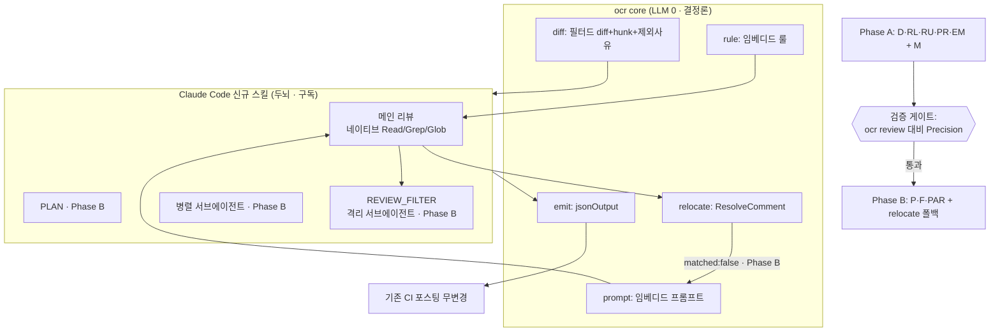

# feat: ocr core — API key 없이 Claude Code에서 도는 코드리뷰

## Summary

기존 `ocr` 바이너리에 LLM 비의존 `ocr core` 명령 그룹(diff/relocate/rule/prompt/emit)을 제적(additive)으로 추가하고, Claude Code 신규 스킬이 이를 `sh`로 호출하며 추론(두뇌)을 맡아 별도 API key 없이 구독만으로 코드리뷰를 돌린다. 단계형으로 인도한다 — Phase A(MVP: 코어 + 단순 메인 리뷰 스킬)를 검증 게이트로 먼저 굳히고, 통과 시 Phase B(PLAN·REVIEW_FILTER·병렬)로 Tier 3 풀 패리티를 채운다.

## Problem Frame

`ocr`는 외부 LLM 엔드포인트로 직접 HTTP를 호출하는 독립 바이너리이고, `internal/llm/resolver.go`의 4단계 자격증명 해석(1순위 config 파일 → OCR env → Claude Code env → shell rc)은 모두 `URL+Token+Model`을 요구한다. Claude Pro/Max 구독으로 로그인만 한 환경은 자격증명이 `~/.claude/.credentials.json`에 저장되고 환경변수로 노출되지 않아 어느 단계에도 걸리지 않는다 — 토큰 없이는 한 줄도 못 돈다 (see origin: `docs/brainstorms/2026-06-23-ocr-core-local-claude-code-requirements.md`).

ocr의 가치(README 기준 동일 모델 대비 토큰 약 1/9, 높은 Precision, line-level 정밀도)는 프롬프트가 아니라 LLM 호출 *주변의* 결정론적 오케스트레이션에서 나오고, 그 부분은 `internal/llm` 없이 동작한다(`ocr review --preview`가 산 증거). 따라서 결정론 기계만 `ocr core`로 노출하고 두뇌를 Claude Code 구독으로 갈아끼우면 API key 비용 없이 리뷰가 가능하다. 단, 리뷰 단계의 검토는 "두뇌만 갈아끼우면 패리티가 유지된다"는 전제가 미검증임을 지적했다(REVIEW_FILTER 전제·대용량 사전필터·유한 루프가 ocr 루프 자체에 박혀 있음). 이 계획은 그 전제를 **검증 게이트**로 다룬다.

---

## Requirements

**코어 명령 그룹 (`ocr core`)**

- R1. `ocr core`의 모든 서브커맨드는 런타임에 LLM/네트워크 호출이 0이다. (임포트 수준 비의존이 아님 — 바이너리는 `ocr review` 때문에 이미 `internal/llm`을 링크한다. 코어는 `llm.ResolveEndpoint*`를 호출하지 않는다.)
- R2. `ocr core diff`는 리뷰 대상 파일·파일별 diff 본문·hunk 라인맵·제외 사유를 JSON으로 출력하고, `filterLargeDiffs`(`MaxTokens*4/5`)와 동일한 토큰 사전필터를 적용해 `ocr review`와 입력 집합을 일치시킨다.
- R3. `ocr core relocate`는 diff, 해당 파일 `new_file_content`, 코멘트(내용·`existing_code`)를 받아 결정론 매칭으로 `start_line`/`end_line`·매칭 성공 여부를 반환한다(`ResolveComment` 래핑, LLM 미사용).
- R4. `ocr core rule <path>`는 경로에 매칭되는 리뷰 룰 문서를 출력한다.
- R5. `ocr core prompt <phase>`는 임베디드 프롬프트(main/plan/filter/relocation)를 출력한다. `compression`은 제외한다.
- R6. `ocr core emit`은 코멘트 배열을 기존 `jsonOutput` 계약으로 감싸 출력한다(필드명 불변).

**기존 동작 보존**

- R7. `ocr review` 등 기존 명령은 변경 없이 동작한다. `core`는 추가일 뿐 기존 경로를 대체하지 않는다.

**Claude Code 스킬 (두뇌 오케스트레이션)**

- R8. 신규 스킬은 `ocr core diff`로 대상을 얻고 파일별 리뷰 파이프라인을 수행한다.
- R9. (Phase B) 변경 라인(= insertions + deletions)이 50 이상인 파일은 메인 리뷰 전 PLAN 페이즈를 수행한다.
- R10. 메인 리뷰는 Claude Code 네이티브 도구(`Read`/`Grep`/`Glob`, `git diff`)로 컨텍스트를 수집한다. ocr의 `file_read`/`code_search`/`file_find`는 코어에 재구현하지 않는다.
- R11. 각 코멘트는 `ocr core relocate`로 라인을 확정하고, 결정론 실패 시에만(Phase B) 스킬이 relocation 프롬프트로 LLM 재배치한다. 재배치도 실패하면 라인 미상(0/0)으로 보고한다.
- R12. (Phase B) 메인 리뷰 후 REVIEW_FILTER 페이즈로 diff에서 반증 가능한 오탐을 제거한다. 필터는 diff-only 격리 컨텍스트에서 실행하고 기본 비활성(opt-in)이다.
- R13. (Phase B) 파일별 처리는 parallel 서브에이전트로 동시 실행하며, 개별 실패는 경고로 대체하고 나머지를 계속한다.

**무 API key / 인증 / 신뢰 경계**

- R14. 이 경로는 별도 LLM 자격증명(API 토큰·URL)을 요구하지 않으며 코어의 LLM 호출은 0이다. "no-API-key" 이점은 Claude Code 구독(OAuth) 로그인에 한하고, 구독 사용량 한도는 적용된다.
- R15. sh 경계의 비신뢰 입력을 검증한다: `ocr core rule <path>`·`ocr core prompt`는 임베디드 자산만 반환하고 외부 경로 이탈(`..`·절대경로)을 거부한다. `ocr core diff`의 git ref는 `--end-of-options`로 방어한다. `relocate`/`emit`의 stdin JSON은 스키마·필드 길이 검증을 통과한다.

---

## Key Technical Decisions

- KTD1 — **제적 서브커맨드 배선.** `cmd/opencodereview/main.go`의 `dispatch` switch에 `case "core"` 한 줄을 추가하고, `runRules`/`runLLM`의 중첩 패턴(`cmd/opencodereview/rules_cmd.go`)을 미러링한 `core_cmd.go`를 만든다. 플래그는 외부 라이브러리 없이 기존 `ocrFlagSet`(`cmd/opencodereview/flags.go`)을 쓴다.
- KTD2 — **새 LLM-free 필터드-diff 진입점.** `internal/agent/preview.go`의 `DiffPreview`는 메타데이터만 담고 diff 본문·hunk 라인맵이 없다. 따라서 `internal/diff`에 provider(`GetDiff`) + allowlist 필터 + `MaxTokens*4/5` 대용량 필터 + `ParseHunks`를 합성해 직렬화 가능한 결과를 돌려주는 공개 진입점을 신설한다. 이것이 이 계획의 유일한 비자명 신규 코드다.
- KTD3 — **relocate는 결정론만.** 기존 `internal/diff/relocation.go`의 `ReLocateComment`는 LLM client를 인자로 받으므로 쓰지 않는다. 순수 텍스트 매칭 `ResolveComment`(+ `resolveFromFileContent`)만 노출하고, 이를 위해 `new_file_content`를 입력으로 받는다. LLM 재배치 폴백은 스킬(Phase B)에 둔다.
- KTD4 — **emit은 기존 계약 재사용.** `cmd/opencodereview/output.go`의 `jsonOutput`과 `model.LlmComment` 구조를 그대로 직렬화한다. `.github/workflows/ocr-review.yml`와 `scripts/github-actions/post-review-comments.test.js`가 필드명을 직접 소비하므로 필드명 변경·`comments` omitempty화는 금지.
- KTD5 — **코어는 자격증명 경로를 타지 않는다.** `runReview`는 `llm.ResolveEndpointWithModelOverride`를 호출하지만 `runPreview`는 호출하지 않는다. 코어 서브커맨드는 preview 경로를 본떠 `llm.ResolveEndpoint*`를 절대 호출하지 않는다 — 그래야 R1(런타임 비호출)·R14(무 자격증명)가 성립한다.
- KTD6 — **신규 별도 스킬.** 기존 `skills/open-code-review/SKILL.md`(`ocr review` 셸 호출)는 건드리지 않고 신규 스킬을 추가한다. "토큰 있으면 review, 없으면 core" 단일 스킬 자동 분기는 follow-up.
- KTD7 — **REVIEW_FILTER 격리.** 필터 프롬프트는 "필터는 diff만 보고 메인은 도구로 더 본다"는 비대칭을 전제한다. 메인 리뷰와 같은 컨텍스트에서 돌면 전제가 깨지므로, 필터는 코드베이스 도구 접근이 없는 diff-only 서브에이전트로 실행한다.
- KTD8 — **단계형 + 검증 게이트.** Phase A는 로컬 인터랙티브 사용으로 한정한다. 무인 CI 자동 실행은 ToS 확인 후로 연기한다. Phase B 진입은 Phase A 검증(`ocr review` 대비 Precision 비교) 통과를 게이트로 한다.

---

## High-Level Technical Design



프롬프트는 authoritative하며 위 다이어그램은 Phase A 경로(실선)와 Phase B 추가(라벨 표기)를 함께 보여준다. 실제 diff 본문/hunk 합성 책임은 KTD2의 신규 진입점에 있다.

## Key Flows

- F1. 단일 파일 리뷰 파이프라인 (Tier 3): `ocr core diff`에서 받은 파일을 (Phase B: 50줄↑ PLAN →) 메인 리뷰(네이티브 도구로 컨텍스트 수집·코멘트 생성) → 코멘트별 relocate → (Phase B: REVIEW_FILTER) → 취합. (U5, U7, U8, U9 / R8–R13)
- F2. 라인 재배치 폴백: `ocr core relocate`가 `matched:false`를 반환하면 (Phase B) 스킬이 relocation 프롬프트로 LLM 재배치를 시도하고, 그래도 실패하면 라인 미상(0/0)으로 보고한다. (U3, U7 / R3, R11)

## Acceptance Examples

- AE1. 변경 49줄 파일은 PLAN을 생략하고 곧바로 메인 리뷰; 50줄 파일은 PLAN을 먼저 수행(변경 라인 = insertions + deletions). — Covers R9.
- AE2. relocate 성공 시 그 라인 범위 사용; `matched:false`면 LLM 재배치 시도, 그래도 실패하면 라인 미상(0/0) 코멘트로 보고. — Covers R3, R11.
- AE3. 코멘트 배열을 `ocr core emit`에 넣으면 기존 `jsonOutput` 스키마와 동일 형태로 출력되어 기존 CI 포스팅이 무변경으로 소비. — Covers R6.

## Output Structure

```text
cmd/opencodereview/
  core_cmd.go          # 신규: runCore + diff/relocate/rule/prompt/emit 서브커맨드
  core_cmd_test.go     # 신규: 플래그 파싱·라우팅 테스트
internal/diff/
  core_diff.go         # 신규: LLM-free 필터드-diff 진입점 (본문+hunk+제외사유)
  core_diff_test.go    # 신규: 인라인 diff 상수 기반 테이블 테스트
skills/
  open-code-review-local/
    SKILL.md           # 신규: 두뇌 오케스트레이션 스킬 (Phase A 단순, Phase B 확장)
```

per-unit `Files`가 정본이며 위 트리는 범위 선언이다.

---

## Implementation Units

### Phase A — MVP + 검증 게이트 (로컬 인터랙티브)

### U1. internal/diff: LLM-free 필터드-diff 진입점

- **Goal:** 필터 적용된 diff를 본문·hunk 라인맵·제외 사유와 함께 직렬화 가능한 형태로 돌려주는, LLM/agent 비의존 공개 함수를 만든다.
- **Requirements:** R1, R2.
- **Dependencies:** 없음.
- **Files:** `internal/diff/core_diff.go`, `internal/diff/core_diff_test.go`.
- **Approach:** `gitcmd.New` → `diff.NewWorkspaceProvider`/`NewProvider`/`NewCommitProvider` 중 선택 → `GetDiff(ctx)` → allowlist(`internal/config/allowlist`) 필터 + `MaxTokens*4/5` 토큰 필터 재현 → 파일별 `ParseHunks(d.Diff)` 합성. `model.Diff`(JSON 태그 완비)와 hunk·제외 사유를 담은 결과 구조체를 반환. `internal/agent`를 경유하지 않아 `Tools.Freeze()` 같은 부수효과를 피한다.
- **Patterns to follow:** `internal/agent/agent.go`의 `loadDiffs`/`filterDiffs`/`filterLargeDiffs` 로직을 agent 밖에서 재현. `internal/agent/preview.go`의 `whyExcluded` 제외 사유 열거.
- **Test scenarios:**
  - Covers R2. workspace/commit/from-to 각 모드에서 diff 본문·`Insertions`/`Deletions`·hunk 라인맵이 채워진다.
  - `MaxTokens*4/5` 초과 파일이 제외되고 제외 사유가 표기된다(경계: 정확히 80% 직전/직후).
  - allowlist 미허용 확장자·바이너리·삭제 파일이 올바른 제외 사유로 분류된다.
  - 빈 diff(변경 없음)에서 빈 결과를 안전하게 반환.
- **Verification:** 새 함수가 `ocr review`가 리뷰하는 파일 집합과 동일한 reviewable 목록을 산출(같은 repo·ref에서 교차 비교).

### U2. `ocr core` 골격 + `diff`·`rule`·`prompt` 서브커맨드

- **Goal:** `ocr core` 명령 그룹을 배선하고 읽기 전용 emit 서브커맨드(diff/rule/prompt)를 제공한다.
- **Requirements:** R1, R2, R4, R5, R7, R15.
- **Dependencies:** U1.
- **Files:** `cmd/opencodereview/core_cmd.go`, `cmd/opencodereview/core_cmd_test.go`, `cmd/opencodereview/main.go`(dispatch에 `case "core"` + usage 한 줄).
- **Approach:** `runRules`(`rules_cmd.go`) 패턴 복제 — `runCore(args)` 2차 switch → 각 말단 러너가 `newOcrFlagSet` 생성. `diff`는 U1 호출 후 JSON 인코딩(`json.NewEncoder(os.Stdout).SetIndent`). `rule <path>`는 `rules` 패키지의 `Resolve` 사용. `prompt <phase>`는 `internal/config/template` 임베디드 프롬프트 반환(`compression` 미지원). `git ref`는 `--end-of-options` 방어(R15), `rule`/`prompt`는 임베디드 자산만 반환하고 외부 경로 이탈 거부(R15).
- **Patterns to follow:** `cmd/opencodereview/rules_cmd.go`, `cmd/opencodereview/llm_cmd.go`, `cmd/opencodereview/flags.go`, `review_cmd.go`의 `validateReviewRefs`(`--end-of-options`).
- **Test scenarios:**
  - Covers R5. `ocr core prompt main` 등 유효 phase가 임베디드 텍스트를 출력하고, `compression`·미지 phase는 에러.
  - Covers R15. `ocr core rule ../../etc/passwd` 류 경로 이탈이 거부된다.
  - `ocr core`(인자 없음)는 usage를 출력한다.
  - dispatch가 `core`를 올바른 러너로 라우팅(`runReview` 등 기존 명령 회귀 없음).
- **Verification:** `ocr core diff` 출력이 U1 결과와 일치하는 JSON; 기존 `ocr review`/`ocr rules` 동작 무변경.

### U3. `ocr core relocate` (결정론 라인 재배치)

- **Goal:** 코멘트의 `existing_code`를 diff/파일 내용에 결정론적으로 매칭해 정확한 라인 범위를 반환한다.
- **Requirements:** R3, R11(결정론 부분), R15.
- **Dependencies:** U2.
- **Files:** `cmd/opencodereview/core_cmd.go`(relocate 러너), `cmd/opencodereview/core_cmd_test.go`. 필요 시 `internal/diff`에 얇은 래퍼.
- **Approach:** stdin JSON `{diff, new_file_content, comment:{content, existing_code}}` 파싱(스키마·길이 검증) → `model.LlmComment`/`model.Diff` 구성 → `diff.ResolveComment(cm, d)` 호출 → `{start_line, end_line, matched}` 출력. `ReLocateComment`(LLM)는 쓰지 않는다(KTD3).
- **Patterns to follow:** `internal/diff/resolver.go`의 `ResolveComment`·`resolveFromFileContent`(`NewFileContent` 의존).
- **Test scenarios:**
  - Covers AE2. hunk 매칭 성공 시 정확한 start/end 라인 반환.
  - `existing_code`가 hunk엔 없지만 `new_file_content`� 있을 때 파일-콘텐츠 폴백이 동작.
  - 매칭 실패 시 `matched:false`(라인 0/0) 반환 — 에러가 아님.
  - 잘못된/과대 stdin JSON이 검증에서 거부된다(R15).
- **Verification:** 동일 입력에 대해 `ocr review`의 내부 relocate 결과와 라인 범위가 일치.

### U4. `ocr core emit` (jsonOutput 재사용)

- **Goal:** 코멘트 배열을 기존 CI 계약 형태로 감싸 출력한다.
- **Requirements:** R6, R15, AE3.
- **Dependencies:** U2.
- **Files:** `cmd/opencodereview/core_cmd.go`(emit 러너), `cmd/opencodereview/core_cmd_test.go`.
- **Approach:** stdin 코멘트 배열(JSON) → `jsonOutput{Status, Summary, Comments, Warnings}` 구성 → stdout. `output.go`의 기존 구조체를 재사용(같은 `package main`). `Comments`는 빈 배열도 항상 출력(omitempty 금지).
- **Patterns to follow:** `cmd/opencodereview/output.go`의 `jsonOutput`/`jsonSummary`, `model.LlmComment`.
- **Test scenarios:**
  - Covers AE3. 코멘트 N개 입력 → 기존 스키마와 동일 필드(`comments`/`start_line`/`end_line`/`existing_code`/`suggestion_code`/`warnings`)로 출력.
  - 코멘트 0개 입력 → `comments:[]`와 `message` 출력(소비자 호환).
- **Verification:** `npm run test:github-actions`(`scripts/github-actions/post-review-comments.test.js`)가 emit 출력으로도 통과.

### U5. Phase A Claude Code 스킬 (단순 메인 리뷰, 로컬 인터랙티브)

- **Goal:** 코어 서브커맨드를 오케스트레이션해 API key 없이 단순 메인 리뷰를 수행하는 신규 스킬.
- **Requirements:** R8, R10, R14, F1(메인 경로), AE1(부분).
- **Dependencies:** U2, U3, U4.
- **Files:** `skills/open-code-review-local/SKILL.md`(신규).
- **Approach:** 흐름 — `ocr core diff` → 파일별로 `ocr core rule`+`ocr core prompt main` 주입, 네이티브 `Read`/`Grep`/`Glob`로 컨텍스트 수집, 코멘트 생성 → 코멘트별 `ocr core relocate` → `ocr core emit`으로 취합. 구독 OAuth 전제·로컬 인터랙티브 한정을 스킬 문서에 명시(R14, KTD8). 기존 `skills/open-code-review/SKILL.md`는 미변경(KTD6).
- **Patterns to follow:** 기존 `skills/open-code-review/SKILL.md`의 invocation 표·구조.
- **Test scenarios:** `Test expectation: none -- 스킬 문서(마크다운)이며 동작 코드 없음. 검증은 U6에서 종단 수행.`
- **Verification:** 토큰/`ANTHROPIC_*` 미설정 환경에서 스킬이 코어를 호출해 코멘트를 산출하고 `ocr review`는 한 번도 호출하지 않는다.

### U6. 검증 게이트 — `ocr review` 대비 Precision 비교

- **Goal:** "두뇌만 갈아끼워도 패리티 유지"라는 전제를 데이터로 검증하고 Phase B 진입을 판단한다.
- **Requirements:** 리뷰 지적(패리티 미검증) 해소.
- **Dependencies:** U5.
- **Files:** `docs/solutions/`(검증 절차·결과 기록 — 산출물). 코드 변경 없음.
- **Approach:** 동일 PR 샘플 세트에서 `ocr review`(키 있는 환경)와 `core+스킬` 결과의 코멘트를 비교 — Precision(보고된 이슈 중 실제 결함 비율) 중심, 라인 정밀도·토큰 사용량 보조 지표. 합격선과 결과를 문서화. 미달이면 Phase B 진입 보류하고 스킬 프롬프트/흐름을 보정.
- **Patterns to follow:** README 벤치마크 방법론(50 repos/200 PR은 과함 — 소규모 샘플로 충분).
- **Test scenarios:** `Test expectation: none -- 검증 활동이며 코드 단위 테스트 대상 아님. 산출물은 비교 리포트.`
- **Verification:** 비교 리포트가 존재하고 Precision이 합격선 이상이면 게이트 통과로 표시.

### Phase B — 풀 패리티 (검증 게이트 통과 후)

### U7. PLAN 페이즈 + relocate LLM 폴백 (스킬)

- **Goal:** 대형 변경에 리스크 분석 PLAN을 추가하고, 결정론 relocate 실패 시 LLM 재배치 폴백을 붙인다.
- **Requirements:** R9, R11(폴백), F1, F2, AE1, AE2.
- **Dependencies:** U5, U6.
- **Files:** `skills/open-code-review-local/SKILL.md`(확장).
- **Approach:** 변경 라인(= insertions+deletions) ≥ 50이면 `ocr core prompt plan`으로 PLAN 선행. `ocr core relocate`가 `matched:false`면 `ocr core prompt relocation`으로 LLM 재배치 시도, 그래도 실패하면 0/0 보고.
- **Test scenarios:**
  - Covers AE1. 변경 49줄은 PLAN 생략, 50줄은 PLAN 수행.
  - Covers AE2. relocate 실패 → LLM 재배치 → 그래도 실패 시 0/0 보고.
- **Verification:** 50줄 경계 파일에서 PLAN 분기와 폴백 경로가 의도대로 동작.

### U8. REVIEW_FILTER 페이즈 (격리 컨텍스트, opt-in)

- **Goal:** 반증 가능한 오탐을 제거하되, 필터 프롬프트의 비대칭 전제를 깨지 않도록 격리 실행한다.
- **Requirements:** R12, F1.
- **Dependencies:** U7.
- **Files:** `skills/open-code-review-local/SKILL.md`(확장).
- **Approach:** 메인 리뷰 후, 코드베이스 도구 접근이 없는 diff-only 서브에이전트로 `ocr core prompt filter`를 실행(KTD7). 기본 비활성, `--filter`/스킬 파라미터로 opt-in.
- **Test scenarios:**
  - Covers R12. 필터 비활성(기본)에서 메인 코멘트가 그대로 보고된다.
  - 필터 활성 시 diff로 반증되는 오탐만 제거되고, 도구로 얻은 컨텍스트 기반 코멘트는 보존된다.
- **Verification:** 필터 활성/비활성 결과 차이가 오탐 제거에 한정.

### U9. 병렬 서브에이전트 + 실패 격리

- **Goal:** 파일별 병렬 처리와 개별 실패 격리 정책을 적용한다.
- **Requirements:** R13.
- **Dependencies:** U7.
- **Files:** `skills/open-code-review-local/SKILL.md`(확장).
- **Approach:** 파일별 parallel 서브에이전트. 개별 실패(한도 초과·타임아웃·도구 오류)는 경고 코멘트로 대체하고 나머지 파일을 계속. 동시성 상한·토큰 예산은 구독 한도를 고려.
- **Test scenarios:**
  - Covers R13. 한 파일 실패가 전체 중단으로 이어지지 않고 경고로 보고된다.
- **Verification:** 일부 파일 강제 실패 시 나머지 결과가 정상 산출.

---

## Scope Boundaries

- `internal/llm`·agent 루프 삭제 — 하지 않는다(additive, R7).
- 비-Claude 두뇌(다른 모델로 코어 구동) — 범위 밖.
- ocr의 토큰 약 1/9 효율 재현 — 비목표.
- `MEMORY_COMPRESSION` 페이즈 포팅 — 비목표(Claude Code 자체 컨텍스트 관리로 대체).

### Deferred to Follow-Up Work

- "토큰 있으면 `ocr review`, 없으면 core 경로" 단일 스킬 자동 분기(KTD6).
- 무인 CI 자동 실행(ToS 확인 후, KTD8).
- 소스/diff 데이터 취급·보호 정책의 정식 문서화(Phase A는 로컬 인터랙티브로 위험 최소화).

---

## Risks & Dependencies

- **패리티 전제 미검증(최상위 리스크).** "두뇌만 갈아끼우면 패리티 유지"는 REVIEW_FILTER 전제·대용량 사전필터·유한 루프가 ocr 루프에 박혀 있어 자명하지 않다. U6 검증 게이트로 완화 — 미달 시 Phase B 보류.
- **U1이 임계 경로 신규 코드.** `DiffPreview`로는 부족(본문·hunk 없음). 합성 진입점이 잘못되면 입력 집합·라인 정밀도가 `ocr review`와 어긋난다. `MaxTokens*4/5` 식과 allowlist를 정확히 재현할 것.
- **구독 한도/ToS.** Tier 3+병렬은 큰 diff에서 구독 한도를 빠르게 소진. 구독으로 third-party 도구 구동(특히 무인 CI)의 ToS 허용 여부 미검증 → Phase A는 로컬 인터랙티브 한정.
- **CI 출력 계약.** emit 필드명 변경·`comments` omitempty화는 `.github/workflows/ocr-review.yml`와 `npm run test:github-actions`를 깬다.
- **의존:** Go 1.25.0 toolchain, `make test`(`go test -race`). docs/solutions·CONCEPTS.md·AGENTS.md 부재 — 규칙 출처는 `CONTRIBUTING.md`.

---

## Open Questions

- `ocr core diff`의 정확한 JSON 스키마(필드명, hunk 라인맵 표현) — 구현 시 확정.
- PLAN 50줄 임계가 Claude Code 환경에 적절한지(원래 ocr 토큰 예산 기준 값) — Phase B에서 재검토.
- `ocr core emit` 호출 주체(스킬 내부 취합 vs 외부 CI 스크립트) — Phase A 구현 시 확정.
- 서브에이전트 동시성 상한·토큰 예산 전략(구독 한도 고려) — Phase B.

---

## Sources / Research

- `internal/llm/resolver.go` — 4단계 자격증명 해석(config 1순위), `URL+Token+Model` 요구. 코어가 우회/회피하는 대상(KTD5).
- `internal/diff/resolver.go` `ResolveComment` + `resolveFromFileContent`(`NewFileContent` 의존) — relocate 기반(U3, KTD3).
- `internal/diff/relocation.go` `ReLocateComment` — LLM 인자 필요, 코어에서 사용 금지(KTD3).
- `internal/agent/preview.go` `DiffPreview`/`whyExcluded` — LLM-free 필터, 단 본문·hunk 미포함(U1, KTD2).
- `internal/agent/agent.go` `loadDiffs`/`filterDiffs`/`filterLargeDiffs`(`limit := MaxTokens*4/5`) — U1이 재현(R2).
- `internal/diff/git.go`, `internal/diff/parser.go`, `internal/diff/hunk.go` `ParseHunks` — provider/파싱/hunk 맵.
- `cmd/opencodereview/main.go` `dispatch`, `cmd/opencodereview/rules_cmd.go`/`llm_cmd.go`, `cmd/opencodereview/flags.go` `ocrFlagSet` — 서브커맨드 배선 패턴(KTD1).
- `cmd/opencodereview/review_cmd.go` `validateReviewRefs`(`--end-of-options`) — git ref 방어 패턴(R15).
- `cmd/opencodereview/output.go` `jsonOutput`/`jsonSummary` — emit 계약(KTD4).
- `internal/config/template/template.go`(`//go:embed task_template.json prompts/*`, PLAN 50/MAX_TOOL 30/MAX_TOKENS 58888), `internal/config/rules/system_rules.go`(`//go:embed`, `Resolve`) — prompt/rule 임베드(R4, R5, R15).
- `.github/workflows/ocr-review.yml`, `scripts/github-actions/post-review-comments.test.js` — emit 소비자·계약 테스트(KTD4).
- `CONTRIBUTING.md`, `Makefile` — 빌드/테스트/커밋 규칙(AGENTS.md·docs/solutions 부재).
